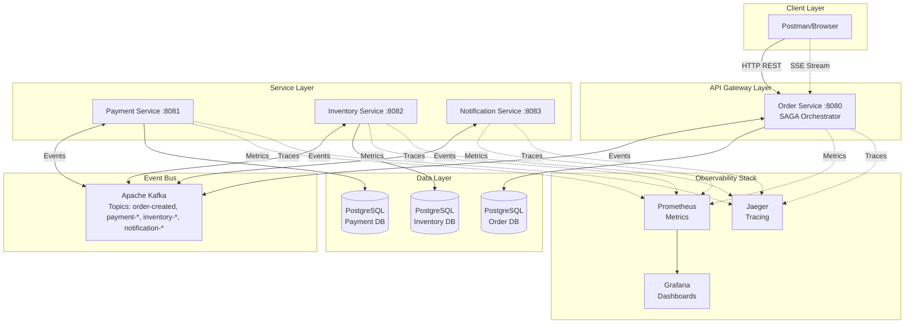
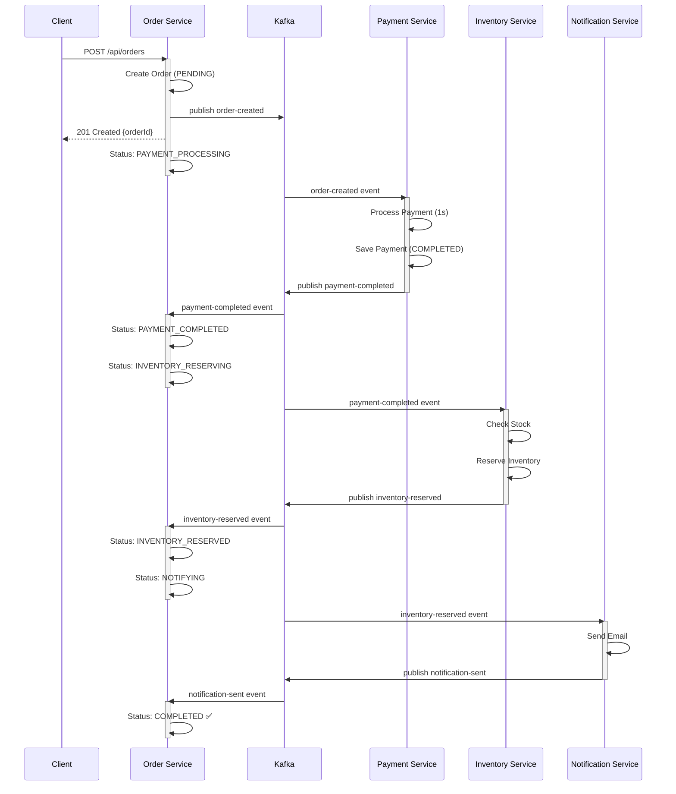
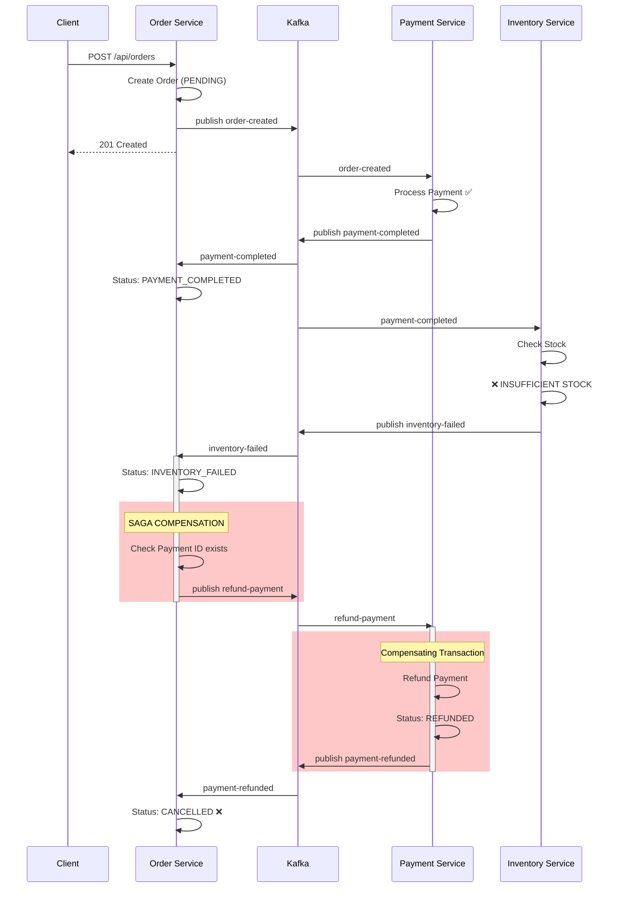
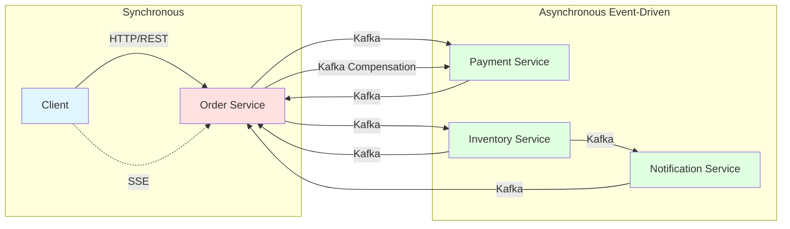
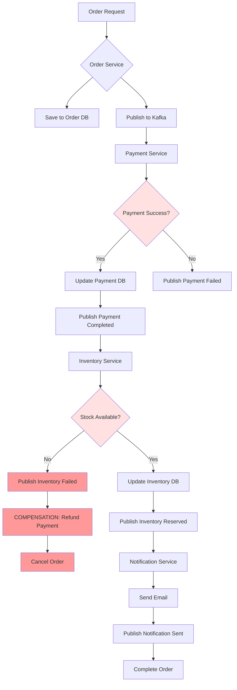
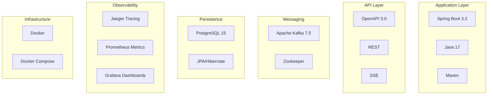
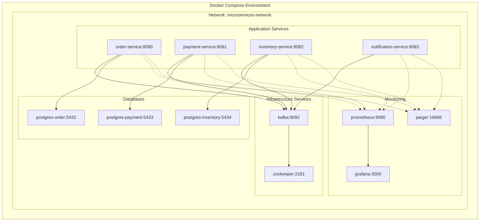

# System Architecture Diagrams

## High-Level Architecture

## SAGA Flow - Happy Path

## SAGA Flow - Compensation (Inventory Failure)

## Service Communication Patterns

## Data Flow

## Technology Stack

## Deployment Architecture

---

## Notes

- **Solid Lines**: Synchronous/Direct communication
- **Dashed Lines**: Asynchronous/Monitoring
- **Red/Pink Boxes**: Error/Compensation paths
- **Green Boxes**: Success paths
- **Blue Boxes**: Entry points

All diagrams represent the actual implemented system architecture.
